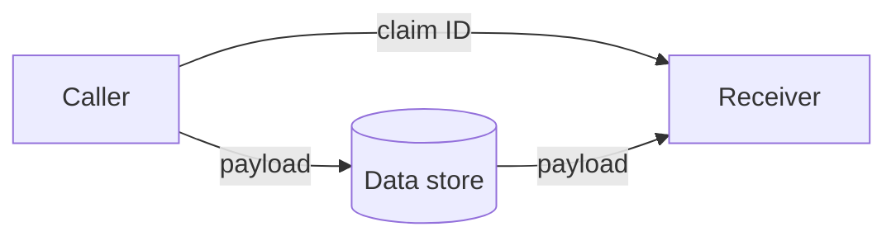

{}Found at [Claim-Check pattern - Cloud Design Patterns | Microsoft Docs](https://docs.microsoft.com/en-us/azure/architecture/patterns/claim-check) on 2022-02-22 18:08:53.{}

# Claim-check design pattern

> Split a large message into a claim check and a payload. Send the claim check to the messaging platform and store the payload to an external service. This pattern allows large messages to be processed, while protecting the message bus and the client from being overwhelmed or slowed down. This pattern also helps to reduce costs, as storage is usually cheaper than resource units used by the messaging platform.

The claim-check design pattern can be useful in the following scenarios:
- The request body payload you're trying to send is too large for the receiving system, e.g., when using an AWS lambda function that has a maximum of 6 MB request body (see [Lambda quotas](https://docs.aws.amazon.com/lambda/latest/dg/gettingstarted-limits.html)).
- You don't trust the caller and want to make sure that the information they're sending is from a trusted source.

